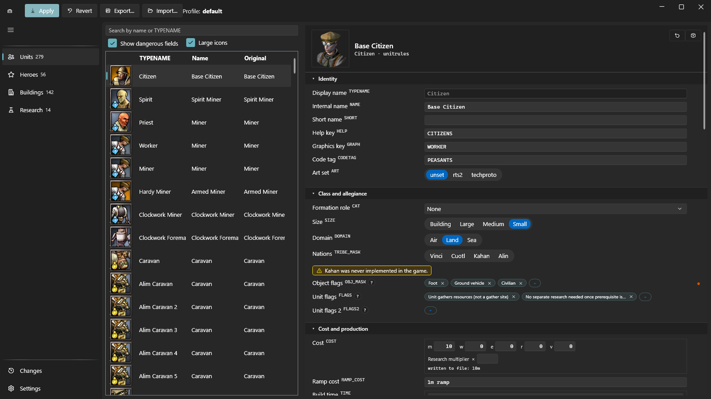
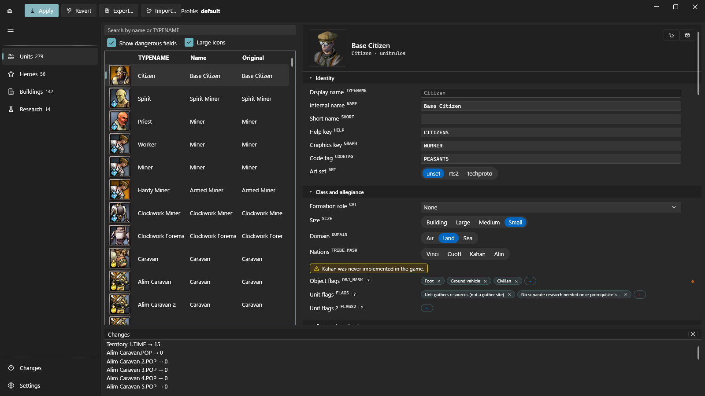
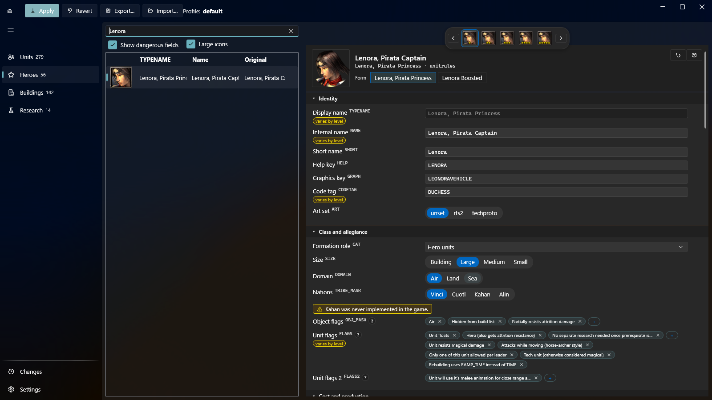

# RoL Rules Editor

Russian: [README.md](README.md)

An editor for the stats of **Rise of Legends**: units, heroes, buildings,
research. Edits pile up in your profile — a named set of edits, its name shown
at the top of the window — and go into the game's archives with one button;
the game can be put back the way it was at any moment.

## What you need

Windows and an installed copy of Rise of Legends. Nothing else to install:
.NET ships inside the package.

## Download

[Release v0.0.1](https://github.com/xxMelkorxx/rol-editor-app/releases/tag/v0.0.1)
— download the archive, unpack it anywhere, run `RolRulesEditor.App.exe`.
There is no installer and nothing is written into the registry, but the program
keeps the game's pristine archives and the database of your edits next to
itself: before deleting the folder, press Revert, and save anything worth
keeping with Export….

**If another author's mod is already installed, read "First run" before you
start.**

## First run

1. Start the program.
2. If the game folder is not found on its own, point at it in the dialog. It
   is the folder that holds the `BIGS` subfolder with `mod_data.big` and
   `multiplayer_data.big` inside. The path is remembered.
3. The program offers to create a pristine copy of the game's archives. Say
   yes.

> **Read this before you say yes.**
>
> The pristine copy is taken from whatever sits in `BIGS` at that moment, and
> that is treated as the original **forever**. If another author's mod is
> already installed, the mod becomes your "original" — and Revert will hand
> you that mod back, not the untouched game. Restore the game's own archives
> first, from your own copy or by reinstalling, and only then start the
> editor.

After that the copy works for you. Applying edits always starts from it, so
"apply twice" and "apply once" give the same result, and Revert puts the game
back exactly where it started.

## Using it

The sections are on the left: Units, Heroes, Buildings, Research, with
Changes and Settings at the bottom. Inside a section the list is on the left
and the card of the selected entry on the right; above the list is a search
box that matches the display name or the internal name (`TYPENAME`). Units,
heroes and buildings are all edited field by field, on equal footing; Research
edits the leader's development branches the same way.

Four buttons across the top:

- **Apply** — write the collected edits into the game's archives.
- **Revert** — give the game back its original archives.
- **Export…** — save your set of edits to a file, to hand over or to keep.
- **Import…** — load a set of edits from a file.

The Changes panel lists everything collected, line by line, so you can see
what is about to go into the game before it does.

**Playing over the network.** Apply writes both of the game's archives, the
multiplayer one included: your rules will no longer match your opponent's.
Press Revert before playing online, and apply again afterwards.

### Two languages, set separately

Settings holds two switches: Interface and Game language. The editor's own
labels and the game's names for things are chosen independently — you can
read the interface in one language while unit names stay as the other
language of the game prints them.

### Heroes

A hero's card carries a level strip above it and, under the title, a form
strip (Lenora and Damanhur are the two characters with a second form). Fields
that change with level are marked: numbers show their range, the rest get a
"varies by level" tag. Editing a marked field changes the current level only;
editing an ordinary field spreads across every level of that form at once.

## Not there yet

0.0.1 is the first release, and it is fairer to say so up front:

- technologies and crafts cannot be opened in the interface at all. Research
  covers the leader's development branches only: 14 branches, 56 records. The
  other 85 technologies and all 509 crafts are there in the game's rule files,
  but have no section of their own yet;
- weapon properties (magic damage, stun and the rest) are shown but cannot be
  edited one by one;
- numeric fields have text boxes, no sliders;
- switching the theme is only partial: some labels stay dim until the editor
  restarts — the settings page says so itself.

What changed from version to version is in the [changelog](CHANGELOG.en.md).

## The knowledge base

The other half of this repository is not the program but a
[knowledge base on the data of Rise of Legends](docs/README.en.md): six
write-ups and an appendix of reference tables.

All of it was read straight out of an installed game's archives — rule files,
string tables, the engine executable — and checked by measurement rather than
taken from someone's retelling. It covers where everything lives and why an
entry can sit in a rule file and still do nothing in battle; what is actually
driven by data and what is welded into the engine and out of reach of any
edit; how to carry a campaign hero into a skirmish; what the four existing
mods changed; how the model and animation formats are built. The appendix
lists units, buildings, technologies, crafts and campaign entities, plus
dictionaries of tags and parameters.

It reads perfectly well without the editor: it is about the game, not about
the program.

## Licenses

- The program — [MIT](LICENSE).
- The documentation and both READMEs — [CC BY 4.0](LICENSE-docs).

No game content is distributed here: no archives, no assets, no text pulled
out of them. What is published are format descriptions and lists of names
obtained by examining an installed game's own data. Rise of Legends is the
property of its rights holders.
