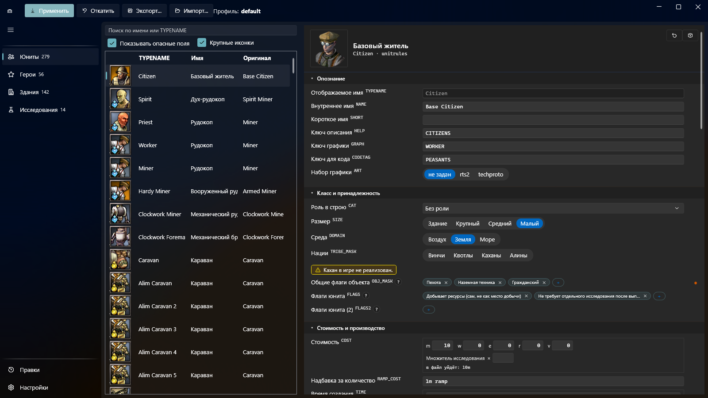
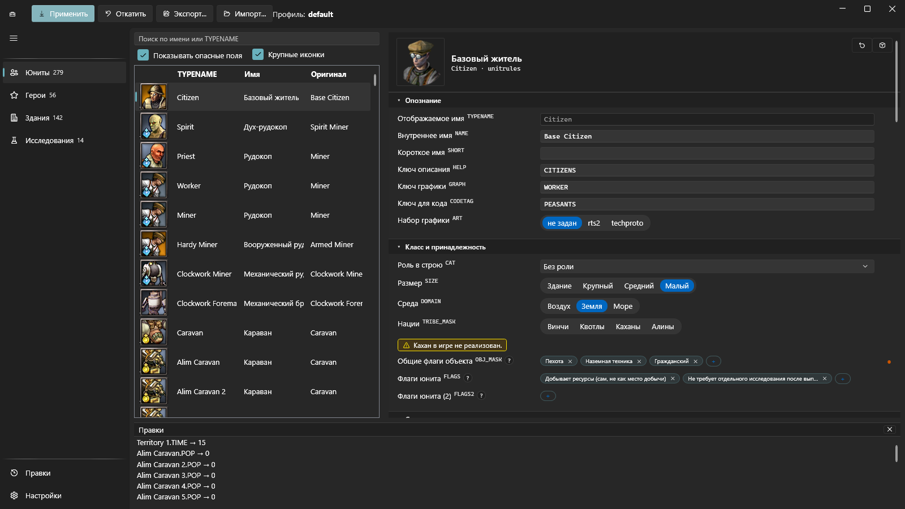
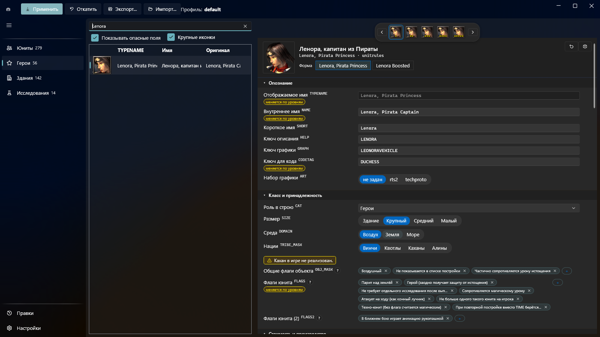

# RoL Rules Editor

English: [README.en.md](README.en.md)

Редактор характеристик **Rise of Legends**: юниты, герои, здания,
исследования. Правки копятся в вашем профиле — это именованный набор правок,
его имя стоит вверху окна — и уходят в архивы игры одной кнопкой, с откатом к
исходным архивам в любой момент.

## Что нужно

Windows и установленная игра Rise of Legends. Больше ничего ставить не надо:
.NET уже внутри поставки.

## Скачать

[Релиз v0.0.1](https://github.com/xxMelkorxx/rol-editor-app/releases/tag/v0.0.1)
— скачать архив, распаковать в любую папку, запустить
`RolRulesEditor.App.exe`. Установка не нужна, в реестр ничего не
прописывается, но рядом с собой программа заводит эталон игры и базу ваших
правок: прежде чем удалять папку, нажмите «Откатить», а нужные правки
сохраните «Экспортом…».

**Если в игре уже стоит чужой мод — сначала прочитайте «Первый запуск».**

## Первый запуск

1. Запустить программу.
2. Если папка игры не нашлась сама — указать её в диалоге. Это папка, внутри
   которой лежит подпапка `BIGS` с файлами `mod_data.big` и
   `multiplayer_data.big`. Путь запомнится.
3. Программа предложит создать эталон — копию исходных архивов игры.
   Согласиться.

> **Прежде чем соглашаться, прочитайте это.**
>
> Эталон снимается с того, что лежит в `BIGS` прямо сейчас, и объявляется
> исходным **навсегда**. Если в игре уже стоит чужой мод, эталоном станет
> он — и «Откатить» будет возвращать вас к чужому моду, а не к оригинальной
> игре. Сначала верните игре оригинальные архивы — из своей копии или
> переустановкой, — и только потом запускайте редактор.

Дальше эталон работает на вас. Применение правок всегда начинается с него,
поэтому «применить дважды» и «применить один раз» дают один и тот же
результат, а откат возвращает игру ровно в то состояние, с которого всё
началось.

## Как пользоваться

Слева разделы: «Юниты», «Герои», «Здания», «Исследования», в подвале —
«Правки» и «Настройки». Внутри раздела слева список, справа карточка
выбранной записи; над списком поиск по имени или по внутреннему имени
(`TYPENAME`). Юниты, герои и здания правятся полем за полем наравне; в
«Исследованиях» так же правятся ветки развития лидера.

Четыре кнопки вверху окна:

- **Применить** — записать накопленные правки в архивы игры.
- **Откатить** — вернуть игре исходные архивы из эталона.
- **Экспорт…** — сохранить свой набор правок в файл: отдать другому или
  отложить на будущее.
- **Импорт…** — загрузить набор правок из файла.

Панель «Правки» показывает всё накопленное строка за строкой — видно, что
именно уйдёт в игру, до того как это туда уйдёт.

**Игра по сети.** «Применить» пишет оба архива игры, включая мультиплеерный:
ваши правила разойдутся с правилами соперника. Перед игрой по сети нажмите
«Откатить», после — примените снова.

### Два языка, независимо друг от друга

В «Настройках» два переключателя: «Интерфейс» и «Язык игры». Язык подписей
редактора и язык игровых названий выбираются по отдельности — можно читать
интерфейс по-русски, а названия юнитов видеть такими, какими их печатает
английская версия игры.

### Герои

У героя над карточкой полоса уровня, а под заголовком — полоса форм (две
формы есть у Леноры и Даманхура). Поля, которые меняются с уровнем, помечены:
у чисел показан диапазон, у остальных — пометка «меняется по уровням». Правка
помеченного поля меняет только текущий уровень; правка обычного поля
расходится на все уровни формы сразу.

## Чего пока нет

Версия 0.0.1 — первая, и честнее сказать сразу:

- технологии и крафты не открыть в интерфейсе ничем. «Исследования» — это
  только ветки развития лидера: 14 веток, 56 записей. Остальные 85 технологий
  и все 509 крафтов в правилах игры есть, а своего раздела пока не получили;
- свойства оружия (магический урон, оглушение и прочее) показываются, но не
  редактируются по отдельности;
- у числовых полей нет ползунков, только поля ввода.

## База знаний

Вторая половина этого репозитория — не программа, а
[база знаний о данных Rise of Legends](docs/README.md): шесть разборов и
приложение из справочников.

Всё в ней прочитано прямо из архивов установленной игры — файлов правил,
строковых таблиц, исполняемого файла движка — и перепроверено измерением, а
не взято из чужих пересказов. Там написано, где что лежит и почему запись
может быть в файле правил, но не работать в бою; что вообще управляется
данными, а что зашито в движок и никакой правкой недостижимо; как перенести
героя кампании в свободную битву; что меняли четыре существующих мода; как
устроены форматы моделей и анимаций. В приложении — списки юнитов, зданий,
технологий, крафтов и сущностей кампании и словари тегов и параметров.

Читать её можно и без редактора: она про игру, а не про программу.

## Лицензии

- Программа — [MIT](LICENSE).
- Документация и оба README — [CC BY 4.0](LICENSE-docs).

Содержимое игры здесь не распространяется: ни архивов, ни ассетов, ни
извлечённых из них текстов. Публикуются описания форматов и списки имён,
полученные разбором данных установленной игры. Rise of Legends принадлежит
правообладателям.
